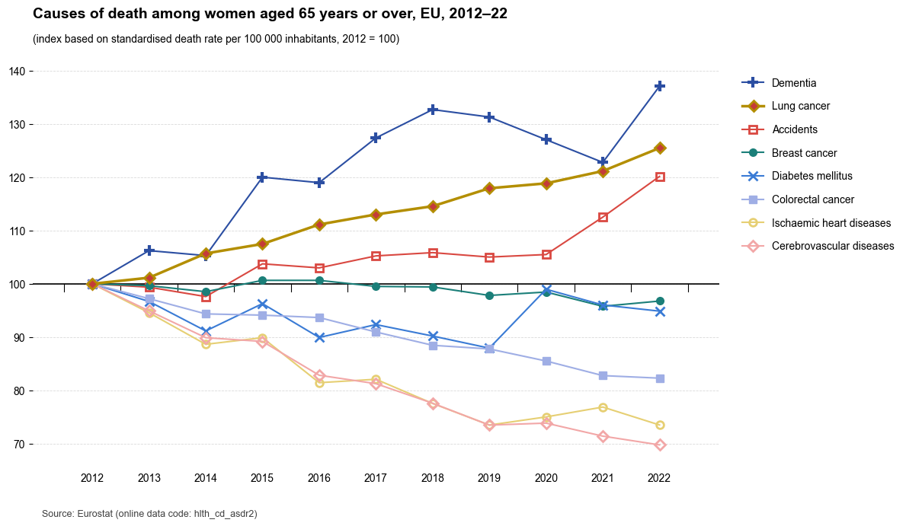

---
title: "INFO 250 Project 2: Making Effective Visualization Using Critical Thinking"
author: "Group 15"
date: "2025-12-18"
---

# 1. Introduction

As societies across Europe continue to **age**, understanding how causes of death change over time has become increasingly important. Such information supports public health policy, healthcare planning, and discussions about the challenges of an aging population. However, data alone is not enough—the way information is **visualized** strongly influences how trends are understood and interpreted.

Statistical agencies such as **Eurostat** provide reliable data with accompanying visualizations, but even accurate charts can be ineffective if they create unnecessary cognitive burden. Poor design may cause key patterns to be misinterpreted or overlooked.

This article examines a **Eurostat chart** showing changes in causes of death among women aged **65 and over in the EU (2012–2022)**. By identifying the limitations of the original static visualization, we demonstrate how design choices affect comprehension and present an **interactive redesign** that improves clarity and accessibility while preserving data integrity.

---

# 2. Context and Visualization Selection

The visualization analyzed in this article originates from **Eurostat**, the statistical office of the European Union, and presents data on **causes of death among women aged 65 years or over** between **2012 and 2022**. The data are expressed as an **index based on the standardized death rate per 100,000 inhabitants**, with the year **2012 set to a baseline value of 100**. This normalization allows readers to focus on **relative changes over time** rather than absolute mortality levels.

The topic of this visualization is **socially and politically significant**. As life expectancy increases across the European Union, the health conditions affecting older populations become a central concern for **policymakers, healthcare systems, and the public**. Understanding which causes of death are becoming more or less prevalent over time can inform **resource allocation, preventive strategies, and long-term healthcare planning**, making clear visualization of such trends essential for public understanding.

This particular visualization was selected because it represents a **common scenario in public data communication**: an authoritative dataset paired with a **conventional but densely packed static line chart**. At first glance, the chart appears comprehensive and informative. However, closer inspection reveals **design choices that make trends difficult to interpret**, especially for **non-expert readers**. The complexity of the visual encoding and the lack of direct access to exact values **limit the chart’s effectiveness**.

By choosing this example, the article aims to illustrate how even **credible official visualizations** can benefit from **redesign**. The goal is not to criticize the data source, but to demonstrate how **thoughtful visualization design** can enhance understanding and make important **public health stories more accessible** to a broader audience.

---

# 3. Original Visualization

The original visualization is a **static multi-line chart** published by **Eurostat**, titled *“Causes of death among women aged 65 years or over, EU, 2012–22.”* It displays **indexed trends for multiple causes of death** across a **ten-year period**, with the horizontal axis representing **time** and the vertical axis showing an **index based on the standardized death rate**, where **2012 is set to 100**, allowing readers to focus on **relative changes over time**.

Each cause of death is represented by a **distinct colored line** with **point markers** indicating yearly observations. A **legend listing all categories** is positioned on the **right-hand side** of the chart. The visualization is designed to show how **mortality patterns among older women in the EU** have changed over time and to **compare trends across causes of death** within a **single consolidated view**.

By presenting all categories within **one figure**, the chart aims to provide a **comprehensive overview** of long-term developments in mortality. Readers are expected to **follow individual lines over time** and use the **legend** to associate each line with its cause of death, thereby understanding **how multiple trends coexist within the same time frame**.

---

# 4. Analysis of the Original Visualization

At first glance, the original Eurostat visualization appears **comprehensive and authoritative**, presenting a large amount of information within a single figure. By indexing the standardized death rate to a **common baseline year**, the chart allows readers to focus on **relative changes over time** rather than absolute values. The use of **line position on a shared vertical scale** is an effective visual encoding and enables **high-level comparison of trends** across different causes of death.

Despite these strengths, several **design choices make the underlying story difficult to follow**. The chart relies on a **detached legend** placed on the right-hand side, listing all causes of death in an order that does not clearly correspond to the visual ordering of the lines. As a result, readers must repeatedly shift their attention between the legend and the chart, creating a **split-attention effect** and increasing **cognitive load**, especially given the number of lines displayed.

In addition, the visualization is **entirely static**, which limits access to **precise information**. Individual data points are marked but not labeled, and readers cannot retrieve **exact values** for specific years without visual estimation. While this supports recognition of general trends, it makes **detailed comparison** difficult, particularly for **non-expert audiences**.

The **density of information** further contributes to the challenge. Multiple lines with **similar colors and overlapping trajectories** compete for attention, requiring sustained effort to track individual causes of death. Although the chart maintains a relatively high **data-ink ratio**, the lack of **direct labeling and interaction** places additional demands on the reader’s **working memory**, hindering efficient comprehension.

Overall, the original visualization provides a **broad overview of mortality trends** among older women in the European Union, but its **static design** and reliance on a **detached legend** limit effective storytelling. The information is present, yet the **effort required to extract insights** may reduce reader engagement and weaken the visualization’s ability to **communicate its message clearly**.

---

# 5. Replicating the Original Visualization

To verify our understanding of the original Eurostat chart, we first replicated the static visualization using the same dataset and visual encoding. The replication was implemented in Python with pandas for data processing and matplotlib for plotting, applying the same index transformation in which the year 2012 is set to 100, thereby preserving the original visual and data structure.

---

# 6. Design Goals and Proposed Improvements

Based on the analysis of the original visualization, the primary goal of the redesign was to make the **underlying trends easier to follow** and the data more accessible to a general audience. Rather than changing the dataset itself, the redesign focuses on improving how the information is presented, emphasizing clarity over visual complexity.

The first design goal was to **reduce cognitive load** caused by the detached legend and dense visual layout. To achieve this, the redesign replaces the traditional legend with **direct labeling**, ensuring that each line is clearly associated with its corresponding cause of death. By positioning labels directly alongside the visual elements, the redesign minimizes the split-attention effect and supports **immediate visual association**.

A second goal was to improve temporal understanding. In the original static chart, all trends are presented simultaneously, which can be overwhelming. The redesigned visualization introduces **animation** to guide attention along the time axis, allowing trends to emerge gradually and reinforcing a clearer sense of progression over time.

Finally, the redesign seeks to improve data accessibility and support **precise comparison**. To address the limitation of unlabeled data points, **interactive features** are introduced that allow users to explore exact values on demand. This balances overview and detail while preserving a clean visual appearance.

Together, these design goals emphasize **clarity, readability, and accessibility**. By combining **direct labeling, animation, and interactivity**, the proposed improvements aim to communicate the data story more effectively and enable a more intuitive reading experience.

---

# 7. Implementation: Interactive Redesign

The redesigned visualization transforms the original static chart into a dynamic and interactive experience implemented as an **HTML-based visualization**. When the page is loaded, all lines begin at the initial year and gradually extend forward along the time axis. This **animated progression** guides the viewer’s attention chronologically and makes it easier to follow how each cause of death evolves over time, supporting a more guided temporal reading process.

To address the limitations of the **detached legend**, each line is accompanied by a **moving label** that extends together with the line. These labels display the **cause of death** and the **current index value** at the end point of the line. Once the animation is complete, the labels remain at the end of their respective lines, creating a clear and direct association between visual elements and their meanings and enabling **immediate identification** of trends.

**Interactivity** further enhances data accessibility. As users move the mouse across the chart, a **tooltip** appears showing the values of all causes of death at the selected year. This enables **precise comparison across categories** while preserving a clean visual layout, allowing users to move smoothly between overview and detail.

Overall, the interactive redesign preserves data integrity while improving **clarity and usability**. Through **animation, direct labeling, and on-demand interaction**, the visualization becomes a more engaging and intuitive representation, making changes in mortality trends easier to understand through active reader engagement.

<!-- Interactive visualization (HTML version only) -->
<iframe 
  src="eurostat_interactive.html"
  width="100%"
  height="725"
  style="border:none;">
</iframe>

Figure 3: Interactive redesign of the Eurostat mortality visualization.  
The figure shows the same dataset as Figure 1, enhanced with animation, direct labeling, and interactive tooltips.  
*Note:*  
*Full interactivity is available in the HTML version of this article.*  
*For a better interactive experience, please adjust the reader interface to the appropriate size when using the interactive charts.*

---

# 8. Comparison: Before vs After

Comparing the original Eurostat visualization with the **redesigned interactive version** highlights how **design choices influence data understanding**. Although both visualizations rely on the same dataset, their effectiveness in communicating trends differs substantially, demonstrating the impact of presentation on comprehension.

In the original chart, all causes of death are shown simultaneously in a static layout, with a **detached legend** positioned to the side. Readers must repeatedly shift attention between the legend and the lines to identify trends. In contrast, the redesigned visualization uses **direct labeling**, allowing each line to be **immediately associated** with its category and **reducing cognitive effort**.

The **representation of time** also differs markedly. The original visualization presents the entire time span at once, which can be overwhelming and obscure year-to-year development. The redesigned version introduces **animation** that gradually reveals trends, guiding attention along the **time axis** and supporting a clearer understanding of temporal change.

**Access to precise data** is another key distinction. In the static chart, values must be visually estimated, limiting detailed comparison. The interactive redesign allows users to retrieve **exact values on demand**, supporting both **overview and detailed analysis** without adding visual clutter.

Overall, this comparison shows that the redesign does not change the data itself, but improves how easily the message can be understood. By reducing **split attention**, guiding visual focus, and enabling **interaction**, the redesigned visualization communicates the same story more **clearly and effectively**, resulting in a more transparent and interpretable data narrative.

---

# 9. Reflection and Conclusion

This case study demonstrates that effective data visualization is not solely about presenting accurate data, but about **enabling understanding**. The original Eurostat chart was based on reliable and meaningful data, yet its **static design** and reliance on a detached legend made the underlying trends difficult to follow. Through analysis and redesign, it became clear that small design decisions can have a substantial impact on how a data story is perceived.

The redesign process highlights the importance of revision in information visualization. By focusing on **reducing cognitive load**, **avoiding split attention**, and guiding reader focus through animation and interactivity, the improved visualization makes the same data more accessible without altering its content. These changes show how visualization design can bridge the gap between complex datasets and non-expert audiences.

More broadly, this exercise underscores the **responsibility of visualization designers**, especially when working with public health data. Visualizations shape how evidence is interpreted and can influence public discourse and decision-making. Clear and thoughtful design is therefore a critical component of responsible data communication, not merely an aesthetic choice.

In conclusion, this article shows that a strong data story requires both accurate data and careful design. By rethinking how information is structured and presented, even well-established visualizations can become clearer and more engaging narratives, reinforcing the value of **iterative design** and the role of information visualization in making **societal data meaningful and understandable**.
